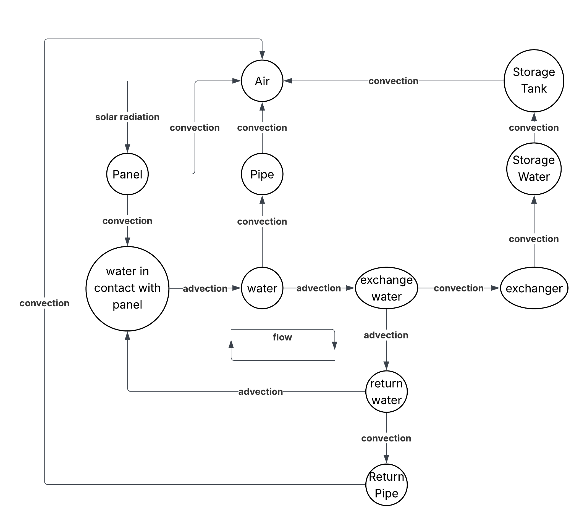

## Setup

Install dependencies: `pnpm i`

Run: `pnpm dev`

---

# Solar Thermal System Heat Transfer Simulation

This project is a TypeScript-based simulation of a solar thermal fluid heating system.  
It models heat transfer between components (solar panel, pipes, heat exchanger, storage tank, etc.) using a **graph-based architecture** where:

- **Nodes** represent `ThermalComponent`s (physical objects/materials with mass, temperature, and thermal properties).
- **Edges** represent `HeatTransferEdge`s (heat exchange between components using a chosen heat transfer strategy).

The simulation supports **conduction**, **convection**, **radiation**, and **advection** between connected components.

---

### General Assumptions
- **1D lumped node model** — no spatial temperature variation inside a component. Each `ThermalComponent` is treated as a uniform temperature node, without internal temperature gradients.
- **Constant material properties** — thermal conductivity, density, and specific heat do not change with temperature.
- **Fixed timestep** — simulation runs in discrete time steps `dt`.
- **Perfect mixing** — fluid temperature in a component is uniform at each timestep.
- **No phase change** — fluid remains liquid at all times.
- **conduction is ignored for simplicity** - instead of modeling two nodes for every boundary material representing conduction between the inner and outer surface, this has been omitted entirely and the single boundary node holds the energy transfer from convection from the inner node and convection from the outer node like fluid/gas -> solid material -> fluid/gas
- **general range assumptions** - material values and heat transfer coefficients came from online sources. Heat coefficients were selected from within provided ranges.
- **solar panel** - modeled as though it were solid copper 

### Advection
- Models heat carried by flowing fluid.
- One-way transport along edges in the flow direction.

### Solar Irradiance
- Modeled as a source component that outputs constant `[W]` to a connected surface (solar panel).

---

### Future Improvements
- allow solar irradiance to be modeled as a function of time
- extend dimensional components of heat transfer equations

